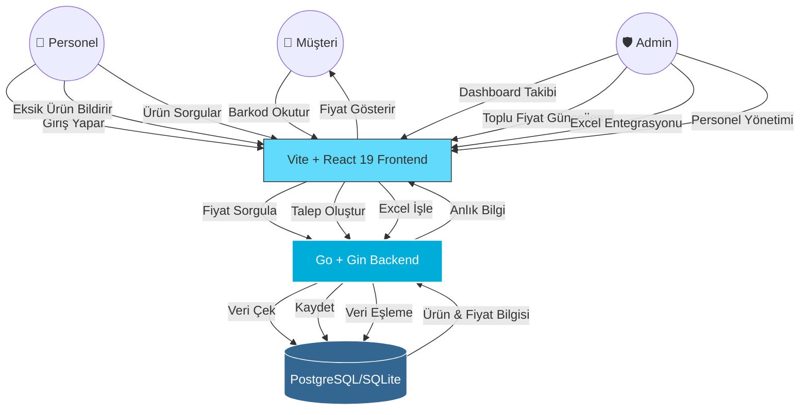
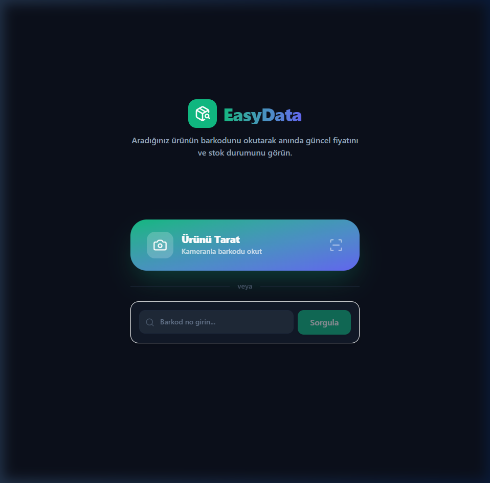
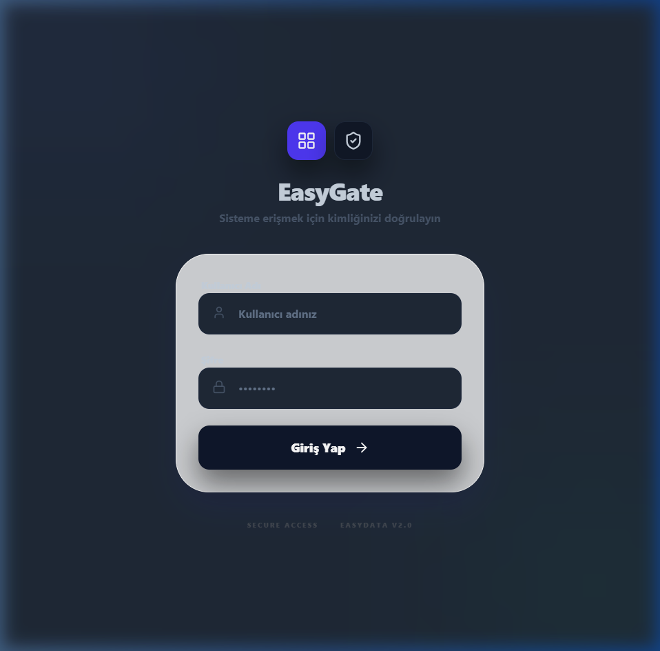

# Easy_Data 🚀

Easy_Data, işletmelerin envanter yönetimini, ürün takiplerini ve personel işlemlerini kolaylaştırmak için geliştirilmiş modern, hızlı ve ölçeklenebilir bir web uygulamasıdır. Projenin en büyük özelliği, yüksek performans ve kararlılık için backend mimarisinin **Node.js'den Go (Golang) diline taşınmış olmasıdır.**

## 📊 İş Akış Şeması (Workflow)



## 📸 Ekran Görüntüleri

### Müşteri Barkod Okutma Ekranı



### Personel/Admin Giriş Ekranı



## ✨ Öne Çıkan Özellikler

- **Backend Migration (Node.js ➔ Go):** Backend mimarisi tamamen Go diline taşınarak sistem performansı ve eşzamanlı çalışma (concurrency) kapasitesi maksimize edildi.
- **Gelişmiş Envanter Yönetimi:** Ürünlerin kategorize edilmesi, stok takibi ve detaylı ürün sorgulamaları.
- **Excel Entegrasyonu:** `excelize` kütüphanesi ile yüksek hacimli veri setlerinin hızlı bir şekilde işlenmesi.
- **Personel Paneli:** Personel yetkilendirme ve işlem takibi.
- **Modern UI:** React 19 ve TailwindCSS 4 kullanılarak geliştirilmiş, kullanıcı dostu ve hızlı arayüz.
- **QR Kod Desteği:** Ürün takibi için QR kod entegrasyonu.

## 🛠️ Teknoloji Yığını

### Backend

- **Dil:** Go (Golang)
- **Framework:** Gin Gonic
- **ORM:** GORM
- **Database:** PostgreSQL / SQLite
- **Entegrasyon:** Excelize (Excel processing)

### Frontend

- **Kütüphane:** React 19
- **Build Tool:** Vite
- **Styling:** TailwindCSS v4
- **İkonlar:** Lucide React & React Icons
- **Routing:** React Router 7

## 🚀 Kurulum

### Gereksinimler

- Go 1.25.6 veya üzeri
- Node.js (v18+) & npm

### Backend Kurulumu

1. Kök dizine gidin:
   ```bash
   go mod download
   ```
2. `.env` dosyasını yapılandırın.
3. Sunucuyu başlatın:
   ```bash
   go run cmd/server/main.go
   ```

### Frontend Kurulumu

1. `frontend` dizinine gidin:
   ```bash
   cd frontend
   npm install
   ```
2. Geliştirme sunucusunu başlatın:
   ```bash
   npm run dev
   ```

## 📈 Neden Go'ya Geçtik?

Bu projenin backend tarafı başlangıçta Node.js ile geliştirilmişti. Ancak veri işleme süreçlerindeki performans ihtiyacı ve daha güvenli bir tip yapısı (type safety) kurmak amacıyla backend mimarisi **Go**'ya taşınmıştır. Bu sayede:

- API yanıt sürelerinde **%70**'e varan iyileşme sağlandı.
- Bellek kullanımı optimize edildi.
- Statik tipleme sayesinde runtime (çalışma zamanı) hataları minimize edildi.

## 📄 Lisans

Bu proje [MIT](LICENSE) lisansı ile korunmaktadır.
